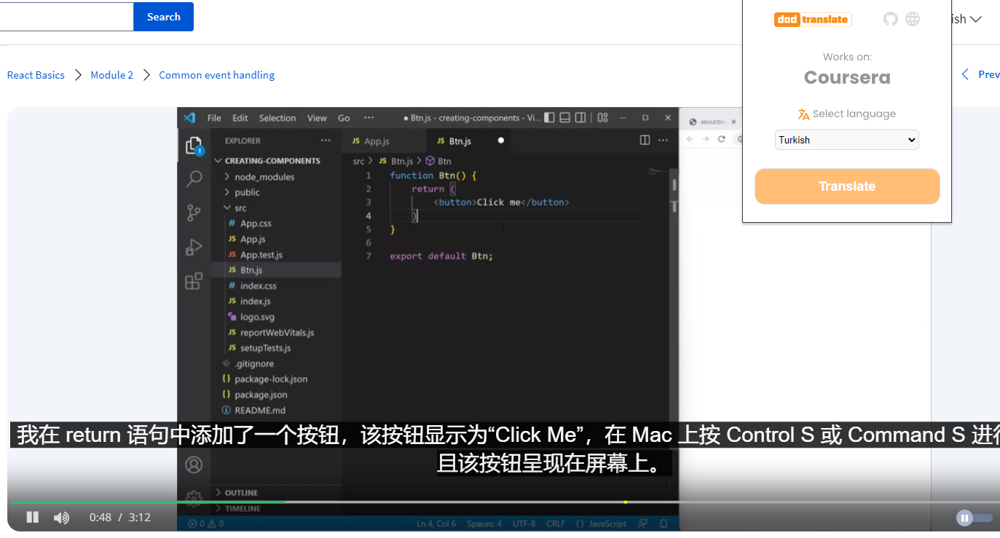

# Subtitle Translator Chrome Extension for Coursera Using Google Translate

This Chrome extension is a tool that automatically translates subtitles for videos on the Coursera platform. With translations performed using the Google Translate API, users can access course materials in different languages and extend their learning experience.

## Features

- **Automatic Subtitle Translation:** Translates subtitles from the original language of the video to the language of your choice.
- **Easy to Use:** It can be activated with a single click and you can easily adjust the language settings you want.
- **Wide Language Support:** It can translate subtitles in all languages supported by Google Translate.

## Installation

1. Create a local copy of this repo with the git clone command.
2. In your Chrome browser, go to chrome://extensions/.
3. Activate "Developer mode" in the top right corner.
4. Click on the "Install unpacked item" button and select the repo folder you downloaded.
5. The extension will be successfully installed in your browser.

## Usage

After installing the plugin, when you open a video on Coursera, you can adjust your translation settings by clicking on the plugin icon. Select the language you want and press the "Translate" button. In a few seconds, the subtitles will be translated into the language of your choice.
